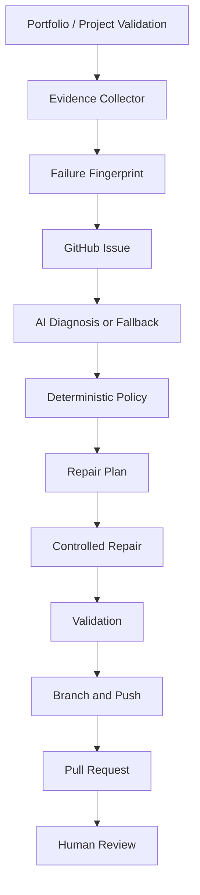

# AI Portfolio Guardian

## Status

| Capability | Status | Notes |
|---|---|---|
| Portfolio validation | IMPLEMENTED | Controlled fixture validation |
| Project repository validation | IMPLEMENTED | GitHub Contents API for `KN-Vignesh/Projects` |
| Evidence collection | IMPLEMENTED | Structured JSON |
| Failure fingerprinting | IMPLEMENTED | Deterministic SHA-256 fingerprint |
| GitHub Issue | PROTOTYPE | Opt-in, fingerprint-aware lookup |
| AI diagnosis | PROTOTYPE | Configurable OpenAI-compatible API with fallback |
| Repair planning | PROTOTYPE | Three known operations |
| Controlled repair | PROTOTYPE | Exact replacement only |
| Validation after repair | IMPLEMENTED | Reference and repository checks |
| Branch creation | PROTOTYPE | Deterministic branch, no force push |
| Pull Request | PROTOTYPE | Real API integration, human review required |
| Auto merge | DISABLED | Never performed |
| Rollback | NOT IMPLEMENTED | Future |
| Advanced sandboxing | NOT IMPLEMENTED | Future |
| Advanced risk engine | PARTIAL | Basic confidence, severity, and diff policy |
| Secret isolation | PARTIAL | Server-side env only; no secret logging |

## Overview

AI Portfolio Guardian is a small infrastructure tool for validating this portfolio and its external project repository. It detects a known failure, collects evidence, fingerprints it, asks an optional AI provider for a structured diagnosis, converts that diagnosis into a finite repair plan, validates the repair, and prepares a human-reviewed pull request.

The Guardian belongs only in this repository. `KN-Vignesh/Projects` remains an external source of truth and is queried through GitHub rather than copied here.

## Why This Exists

Portfolio metadata can drift from the external project repository. The Guardian demonstrates an auditable reliability loop while keeping the visitor-facing React application and its AI assistant separate from repository credentials and repair permissions.

## Architecture



The code is separated into detection, evidence, diagnosis, policy, planning/execution, validation, and Git/GitHub adapters. The AI proposes; the policy engine and deterministic executor decide what can happen.

## End-to-End Flow

1. Read the controlled project reference fixture.
2. Compare it with the expected validated path.
3. Normalize evidence and create a deterministic fingerprint.
4. In prototype write mode, reuse an open issue with the fingerprint or create one.
5. Diagnose through the configured AI provider, or use the deterministic fallback.
6. Validate the diagnosis and repair operation against policy.
7. Simulate or apply only the approved exact replacement.
8. Run project-reference and external repository validation.
9. Produce a diff and deterministic `guardian/<fingerprint>` branch plan.
10. In explicit prototype write mode, commit, push, and create a PR.
11. Stop at `REQUIRES_HUMAN_REVIEW`; auto-merge is disabled.

## Current Implementation

### Working Prototype

- `guardian/cli.ts` is the local entrypoint.
- `guardian/pipeline.ts` stores a structured run state and explicit statuses.
- The fixture scenario repairs `Ai-Cookbook/QLoraFine-Tuning-LEGACY` to `Ai-Cookbook/QLoraFine-Tuning`.
- GitHub repository and path validation use the Contents API.
- AI output is schema-checked and fails closed to a deterministic diagnosis when unavailable or invalid.
- Supported operations are `replaceExactText`, `updateProjectReference`, and `updateKnownConfiguration`.
- Dry-run performs detection through diff/PR preview without source, branch, issue, or PR writes.
- Prototype mode can create an issue, apply the fixture repair, validate it, create a branch, push it, and create a real PR when explicitly enabled.

### Current Implementation State

Last updated: 2026-09-23  
Guardian version: 0.1.0 prototype

Working:

- Detection, structured evidence, fingerprinting, fallback diagnosis, policy checks, simulated repair, validation, and preview data.

Prototype:

- AI API diagnosis, issue creation, source repair, branch push, and pull request creation.

Partial:

- Basic risk and secret handling policies; GitHub validation is live but the controlled fixture is intentionally narrow.

Disabled:

- Auto-merge and direct modification of `main`.

Not implemented:

- Rollback, sandboxed execution, distributed locks, signed plans, deployment verification, and arbitrary repository repair.

## Demo Scenario

The fixture is intentionally broken and safe to reverse. It does not alter production portfolio metadata. Run the demo in about 5–10 minutes:

1. Run `npm run guardian` and show `DETECTED`, evidence, fingerprint, fallback diagnosis, repair plan, simulated diff, and `REQUIRES_HUMAN_REVIEW`.
2. Show `guardian/fixtures/project-reference.json` and its `-LEGACY` value.
3. Run `npm run guardian:test`.
4. For a GitHub demo, configure the secrets below, set `GUARDIAN_MODE=prototype`, set `GUARDIAN_GITHUB_WRITE=true`, and run the manual workflow.
5. Show the issue, branch, PR body, validation result, and the explicit human review requirement.
6. Restore the fixture after a prototype write demo or close the demonstration PR without merging.

## Local Setup

Install with the repository's existing peer-resolution requirement. The generated npm lockfile is committed so the manual workflow can use `npm ci`:

```bash
npm install --legacy-peer-deps
npm run guardian:test
npm run guardian
npm run lint
npm run build
```

The default is `GUARDIAN_MODE=dry-run`. It performs no source, branch, issue, or PR writes.

## GitHub Actions

`.github/workflows/guardian.yml` exposes `workflow_dispatch` with `dry-run` and `prototype` choices. Dry-run receives `contents: read`; prototype is a separate job with only `contents: write`, `issues: write`, and `pull-requests: write`. GitHub write credentials are passed only through secrets and are not exposed to the React client.

## Configuration

| Variable | Purpose | Default |
|---|---|---|
| `GUARDIAN_MODE` | `dry-run` or `prototype` | `dry-run` |
| `GUARDIAN_PROJECT_OWNER` | External repository owner | `KN-Vignesh` |
| `GUARDIAN_PROJECT_REPOSITORY` | External repository name | `Projects` |
| `GUARDIAN_PROJECT_BRANCH` | External branch | `main` |
| `GUARDIAN_GITHUB_WRITE` | Enables issue/branch/PR writes in prototype mode | `false` |
| `AI_MODEL` | Provider model | `gemini-2.5-flash` |
| `AI_BASE_URL` | OpenAI-compatible diagnosis endpoint | Gemini compatibility endpoint |

## Environment Variables and Secrets

Used only by server-side/local tooling:

- `GITHUB_TOKEN` or `GUARDIAN_GITHUB_TOKEN` in Actions: repository read/write token as required by the selected mode.
- `AI_API_KEY` or `GEMINI_API_KEY`: optional diagnosis provider key.
- `AI_MODEL`: optional provider model.
- `AI_BASE_URL`: optional OpenAI-compatible endpoint.

The workflow maps `GUARDIAN_GITHUB_TOKEN` and `GUARDIAN_AI_API_KEY` secrets to the process. No token or AI key is bundled, logged, or sent to browser JavaScript.

## AI Diagnosis

The provider boundary is `diagnose()` in `guardian/ai.ts`. The initial provider uses an OpenAI-compatible chat-completions request, but the rest of the Guardian only consumes the `Diagnosis` schema. Missing credentials, transport errors, malformed JSON, invalid confidence, invalid severity, or invalid required fields use the deterministic fallback. An invalid AI response cannot directly execute a repair.

## Repair Engine

Every operation contains `operation`, `file`, `oldValue`, `newValue`, and `reason`. The executor only replaces the first exact occurrence of the approved old value. It cannot run shell commands, Python, JavaScript, dependency installation, arbitrary deletion, workflow changes, secret changes, or infrastructure changes.

## Policy Engine

The prototype enforces known operations, repository-relative paths, confidence at least `0.8`, low/medium-risk scope, maximum three operations/files, supported text extensions, non-empty distinct values, and a maximum changed-line policy of 50. Protected paths include `.github/workflows/`, `.env`, `.env.*`, lockfiles, `credentials`, `secrets`, and `infrastructure/`.

## Security Model

Current maturity: **Level 2, deterministic policy enforcement**, with a Level 1 end-to-end prototype foundation. The Guardian is server-side tooling only. It never edits `main`, force-pushes, auto-merges, or gives the AI shell access. Validation failure prevents PR creation. Advanced sandboxing and production-grade isolation are not claimed.

## Current Guardrails

| Guardrail | Status | Why |
|---|---|---|
| Arbitrary command prevention | IMPLEMENTED | AI cannot execute commands |
| Protected paths | IMPLEMENTED | Sensitive files cannot be repair targets |
| Exact known operations | IMPLEMENTED | Limits blast radius |
| Confidence and severity policy | IMPLEMENTED | Rejects uncertain/high-risk repairs |
| Diff/file limits | IMPLEMENTED | Limits blast radius |
| Human PR review | IMPLEMENTED | No autonomous merge |
| Fingerprint idempotency | IMPLEMENTED | Reuses matching open issue |
| Sandboxed execution | FUTURE | Isolate repair execution |
| Signed repair plans | FUTURE | Improve provenance |
| Automatic rollback | FUTURE | Recover from production failures |
| Advanced risk scoring | NEXT | Better repair decisions |

## Current Limitations

The demo detector targets one fixture, the prototype currently has no distributed concurrency lock, the GitHub issue search is intentionally small, and the AI adapter supports one OpenAI-compatible request shape. The workflow defaults to read-only dry-run and real write demonstrations require repository permissions. These are prototype limitations, not hidden capabilities.

## Remaining Guardrails

| Guardrail | Status | Planned implementation | Risk reduced | Priority |
|---|---|---|---|---|
| Strong schema validation | NEXT | Add JSON schema library and provider contract tests | Malformed diagnosis | High |
| Permission isolation | NEXT | Separate validation, issue, and repair workflows | Credential blast radius | High |
| Secret scanning | NEXT | Scan evidence and diffs before issue/PR writes | Secret disclosure | High |
| Concurrency controls | NEXT | Lock/idempotency records for active runs | Duplicate repairs | Medium |
| Sandboxed execution | FUTURE | Isolated worktree/container | Arbitrary side effects | High |
| Signed repair plans | FUTURE | Sign approved plan and provenance | Tampering | Medium |
| Rollback | FUTURE | Revert PR and deployment-aware recovery | Failed remediation | High |

## Roadmap

### NOW

Deterministic validation, evidence, fingerprinting, issue integration, optional AI diagnosis, constrained repair, validation, branch, PR, and human review.

### NEXT

Stronger schema validation, permission isolation, secret scanning, richer risk scoring, diff validation, concurrency controls, idempotent run storage, and issue lifecycle management.

### LATER

Sandboxed repair execution, isolated worktrees, policy-as-code, signed artifacts, stronger provenance, threat detection, provider fallback, observability, and deployment verification.

### FUTURE

Production rollback, canary verification, additional remediation classes, multi-repository support, orchestration, formal policies, approval UI, and a Guardian dashboard.

## Testing

`guardian/pipeline.test.ts` covers evidence detection, deterministic fingerprinting, fallback diagnosis, simulated repair, protected paths, and unknown operation rejection. Run `npm run guardian:test`. The application checks are `npm run lint` and `npm run build`.

## Example Run

```text
DETECTED
fingerprint: deterministic 12-character SHA-256 prefix
diagnosis: stale project path
repair: updateProjectReference, exact old/new value
validation: project-reference-check
git: guardian/<fingerprint>, preview only in dry-run
status: REQUIRES_HUMAN_REVIEW
```

## Example Issue

Prototype mode creates an issue containing Guardian Run, Failure, Evidence, Fingerprint, Environment, and Detected At. An existing open issue containing the same fingerprint is reused.

## Example Diagnosis

```json
{
  "diagnosis": "The portfolio references a stale project path.",
  "rootCause": "The configured path differs from the validated path.",
  "confidence": 0.99,
  "severity": "low",
  "recommendedAction": "Update the known project reference.",
  "repairOperations": ["updateProjectReference"]
}
```

## Example Repair

```json
{
  "operation": "updateProjectReference",
  "file": "guardian/fixtures/project-reference.json",
  "oldValue": "Ai-Cookbook/QLoraFine-Tuning-LEGACY",
  "newValue": "Ai-Cookbook/QLoraFine-Tuning",
  "reason": "Use the path confirmed by the external Projects repository."
}
```

## Example PR

Prototype mode uses branch `guardian/<fingerprint>`, pushes without force, and creates a PR with Problem, Evidence, AI Diagnosis, Repair, Validation, Risk, Fingerprint, and `Human Review Required: Yes`. It never merges.

## Portfolio Presentation

The Guardian is intentionally infrastructure rather than a client-side feature. Present it as: “An AI-assisted reliability and remediation system that validates a software portfolio, diagnoses failures, proposes constrained repairs, validates changes, and prepares human-reviewed pull requests.” The current implementation is a working prototype, not a production autonomous agent.

## Known Issues

- npm dependency installation currently requires `--legacy-peer-deps` because the existing Vite/esbuild peer ranges do not resolve cleanly.
- Real issue, branch, and PR validation requires a token with appropriate repository permissions and was not executed as part of local dry-run validation.
- The fixture is intentionally a controlled demonstration target and should not be confused with the React portfolio's source metadata.

## Changelog

### 2026-09-23

- Added the end-to-end Guardian prototype.
- Added structured evidence, fingerprinting, fallback/AI diagnosis, policy validation, controlled repair, validation, branch planning, GitHub issue integration, and PR integration.
- Added dry-run defaults, manual GitHub Actions workflow, tests, fixture, and living architecture documentation.

## Future Architecture Ideas

Future work can add a run store, signed plans, isolated worktrees, provider adapters, policy-as-code, richer repository checks, deployment verification, and a review dashboard without changing the core Detection → Evidence → Diagnosis → Policy → Plan → Execution → Validation → Git boundary.

## Explicit Non-Goals

There is no generic autonomous coding agent, arbitrary command execution, auto-merge, rollback, microservice deployment, database, queue, or copy of the external `Projects` repository.